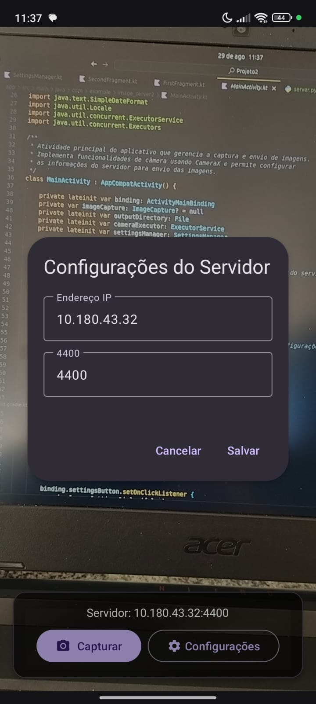
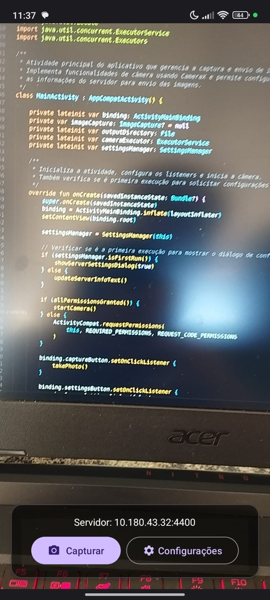

# 📸 Camera_Server - Aplicativo de Captura e Transmissão de Imagens

Este projeto consiste em um sistema de captura e transmissão de imagens em tempo real, composto por um aplicativo Android que tira fotos e as envia para um servidor Python que as exibe em uma interface gráfica.

## 🔍 Visão Geral

O sistema é dividido em duas partes principais:

### 📱 Aplicativo Android
- Captura fotos usando a câmera do dispositivo
- Interface moderna com Material Design 3
- Permite configurar o IP e porta do servidor
- Envia as imagens capturadas para o servidor via rede

### 💻 Servidor Python
- Recebe as imagens enviadas pelo aplicativo Android
- Exibe logs de conexão e recebimento de imagens
- Mostra a imagem recebida em uma interface gráfica com Tkinter

## 📋 Pré-requisitos

### Para o Aplicativo Android:
- Android Studio (versão mais recente)
- JDK 17 ou superior
- Dispositivo Android com API 24 (Android 7.0) ou superior
- Permissões de câmera no dispositivo

### Para o Servidor Python:
- Python 3.6 ou superior
- Pillow (PIL) para processamento de imagens
- Tkinter para interface gráfica

## 🛠️ Instalação e Execução

### Aplicativo Android:

1. Clone o repositório:
   ```bash
   git clone [URL_DO_REPOSITORIO]
   cd Camera_Server-daniel
   ```

2. Crie o arquivo `local.properties` na raiz do projeto e configure o caminho do SDK:
   ```properties
   sdk.dir=/caminho/para/seu/Android/Sdk
   ```

3. Abra o projeto no Android Studio:
   - Abra o Android Studio
   - Selecione "Open an existing project"
   - Navegue até a pasta `Camera_Server-daniel` e selecione-a

4. Compile e instale o aplicativo:
   ```bash
   ./gradlew assembleDebug
   ```
   Ou execute diretamente do Android Studio pressionando o botão "Run"

5. Ao abrir o aplicativo pela primeira vez, você será solicitado a configurar o IP e porta do servidor

### Servidor Python:

1. Instale as dependências necessárias:
   ```bash
   pip install pillow
   ```
   
2. Navegue até a pasta do servidor:
   ```bash
   cd Camera_Server-daniel/server
   ```

3. Execute o servidor:
   ```bash
   python main.py
   ```
   
4. Uma janela do Tkinter será aberta, mostrando logs e aguardando conexões de clientes

## 📡 Como usar

1. Primeiro, inicie o servidor Python em um computador que esteja na mesma rede do dispositivo Android

2. Anote o endereço IP do computador onde o servidor está rodando

3. Abra o aplicativo no dispositivo Android e configure o IP e porta nas configurações:
   - IP: IP do computador onde o servidor está rodando
   - Porta: 4400 (padrão, pode ser alterada no código do servidor)

4. Use o botão "Capturar" para tirar uma foto com a câmera do dispositivo

5. A imagem será automaticamente enviada para o servidor e exibida na interface gráfica

## 🔍 Como funciona

1. O aplicativo Android captura uma imagem utilizando a CameraX API
2. A imagem é salva temporariamente no dispositivo
3. Um socket TCP é estabelecido com o servidor na porta configurada
4. O aplicativo envia o tamanho da imagem (4 bytes) seguido pelos dados da imagem
5. O servidor recebe o tamanho, seguido pelos dados da imagem
6. A imagem é reconstruída e exibida na interface Tkinter

## ⚠️ Possíveis problemas e soluções

- **Erro de conexão**: Verifique se o IP e porta estão configurados corretamente e se o servidor está em execução
- **Permissões negadas**: Certifique-se de que o aplicativo tem permissão para acessar a câmera
- **Erros de compilação**: Verifique se o caminho do SDK está correto no arquivo `local.properties`

## 🔒 Permissões necessárias

O aplicativo Android requer as seguintes permissões:
- `android.permission.CAMERA` - Para acessar a câmera do dispositivo
- `android.permission.INTERNET` - Para enviar imagens pela rede
- `android.permission.WRITE_EXTERNAL_STORAGE` - Para salvar temporariamente as imagens


## 📱 Prints da Aplicação

### 📱 Aplicativo Android

<div align="center">
  
  
</div>

### 💻 Servidor Python


*Interface do servidor aguardando conexões*


*Servidor exibindo imagem recebida do dispositivo Android*

## 📝 Notas

- O servidor aceita conexões de qualquer endereço IP ("0.0.0.0")
- As imagens são redimensionadas para 400x400 pixels no servidor antes de serem exibidas
- Os logs do servidor mostram o tamanho da imagem recebida e o status da transferência
